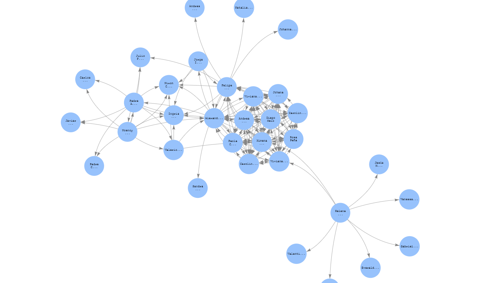

# Neptune database with Gremlin

## Files
- *Create_csv.ipynb* generates csv files to be loaded to S3 buckets
- *gremlin_graph.ipynb* connects S3 instance with Neptune DB and uses Groovy to query and visualize the vertex and edges

Final result:

